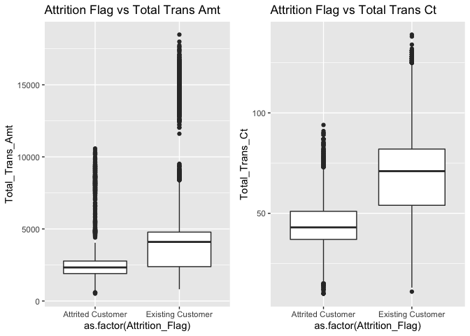
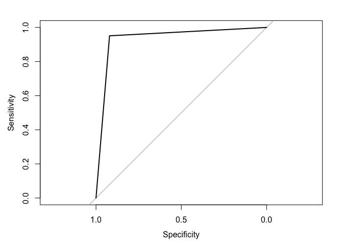

---
# Banking Attrition Rate Analysis & Predictions
## Erik So
---

Bank Data CSV was obtained through Kaggle: https://www.kaggle.com/sakshigoyal7/credit-card-customers

This report / submission is an attempt to predict customers who may leave a bank/credit card company, given a variety of predictors.

# Table of Contents

* [Loading Packages](https://github.com/eso17/Bank-Attrition-Analysis/blob/main/README.md#1-loading-packages)
* [Data Preparation](https://github.com/eso17/Bank-Attrition-Analysis/blob/main/README.md#2-data-preparation)
* [Initial Analysis](https://github.com/eso17/Bank-Attrition-Analysis/blob/main/README.md#3-initial-analysis)
  * [PCA](https://github.com/eso17/Bank-Attrition-Analysis/blob/main/README.md#pca)
  * [Box Plots](https://github.com/eso17/Bank-Attrition-Analysis/blob/main/README.md#box-plots)
    * [Key Variables](https://github.com/eso17/Bank-Attrition-Analysis/blob/main/README.md#key-variables)
    * [Non-key Variables](https://github.com/eso17/Bank-Attrition-Analysis/blob/main/README.md#non-key-variables)
  * [Demographic Analysis](https://github.com/eso17/Bank-Attrition-Analysis/blob/main/README.md#demographic-analysis)
* [Model Building & Implemenation](https://github.com/eso17/Bank-Attrition-Analysis/blob/main/README.md#4-predictive-model-building--results)
 * [Generating Training and Test Set](https://github.com/eso17/Bank-Attrition-Analysis/blob/main/README.md#generating-training-and-test-set)
 * [Simple Logistic Regression](https://github.com/eso17/Bank-Attrition-Analysis/blob/main/README.md#simple-logistic-regression)
 * [Decision Tree](https://github.com/eso17/Bank-Attrition-Analysis/blob/main/README.md#decision-tree)
 * [Bagged Trees](https://github.com/eso17/Bank-Attrition-Analysis/blob/main/README.md#bagged-trees)
 * [Random Forest](https://github.com/eso17/Bank-Attrition-Analysis/blob/main/README.md#random-forest)
  * [Visualization of the RF Model Performance](https://github.com/eso17/Bank-Attrition-Analysis/blob/main/README.md#visualization-of-the-rf-model-performance)
 * [KNN](https://github.com/eso17/Bank-Attrition-Analysis/blob/main/README.md#knn)
 * [XGBoost](https://github.com/eso17/Bank-Attrition-Analysis/blob/main/README.md#xgboost)
 
 
# 1) Loading Packages


``` r
library(readr)
library(caret)
library(dplyr)
library(knitr)
library(ggplot2)
library(pdp)
library(mice)
library(xgboost)
library(ggfortify)
library(dummies)
library(cluster)
library(MASS)
library(tidyverse)
library(rpart.plot)
library(MASS)
library(randomForest)
library(car)
library(DMwR)
library(pROC)
```

# 2) Data Preparation


``` r
Bank_Data <- read_csv("Bank_Churn_Data.csv")
Bank_Data <- as.data.frame(Bank_Data)

Bank_Data[,"Attrition_Flag"] <- as.factor(Bank_Data[,"Attrition_Flag"])
Bank_Data[,"Gender"] <- as.factor(Bank_Data[,"Gender"])
Bank_Data[,"Education_Level"] <- as.factor(Bank_Data[,"Education_Level"])
Bank_Data[,"Marital_Status"] <- as.factor(Bank_Data[,"Marital_Status"])
Bank_Data[,"Income_Category"] <- as.factor(Bank_Data[,"Income_Category"])
Bank_Data[,"Card_Category"] <- as.factor(Bank_Data[,"Card_Category"])

Bank_Data <- Bank_Data[,-c(22,23)]

#class(Bank_Data$Attrition_Flag)

#summary(Bank_Data)
```

# 3) Initial Analysis


PCA
------------

``` r
bank_temp <- Bank_Data[-c(1,2,4,6,7,8,9)]

train_pca = prcomp(bank_temp[], scale = TRUE)

pca_var = train_pca$sdev^2
prop_varex <- pca_var/sum(pca_var) #Proportion of variance

k=0
i=0
while (k<.95) {
  i <- i + 1
  k <- k + prop_varex[i]
}
k
```

    ## [1] 0.9571322

``` r
i
```

    ## [1] 10

``` r
plot(cumsum(prop_varex),type='b',main="Cumulative Proportion of Variance for PCA", ylab = "Cumulative Proportion of Variance", xlab = "PCA")
```


Implementing principle component analysis here. The number of principle
components needed to represent 95% of the cumulative proportion of
variance is approximately 10 components.

``` r
plot(prop_varex,type='b', main="Proportion of Variance Per PCA", ylab = "Proportion of Variance", xlab = "PCA")
```


``` r
autoplot(train_pca, loadings = TRUE, loadings.colour = 'blue', loadings.label = TRUE, loadings.label.size = 3, label = FALSE, shape = FALSE)
```


``` r
autoplot(train_pca, loadings = TRUE, loadings.label = TRUE, loadings.label.size = 3.5, label = FALSE, shape = TRUE, loadings.label.colour = 'red')
```


``` r
autoplot(cor(bank_temp))
```


Total transaction amount and total transaction count seem to have
similar loadings. This makes sense, generally the more transactions that
an individual utilizes, they will be more likely to have moved more
money. Credit limit and Avg Open To Buy also have very similar loadings.
This also makes sense as individuals with a higher credit limit will
likely have more money available within their credit line that could be
spent on products and services. Another relationship to highlight is
that the months that an individual spends with a specific credit card
firm will have a somewhat strong relationship with how old that person
is. The older the individual is, the more likely that they have spent
more time with the credit card company. One last thing to bring
attention to is the Average Utilization Ratio. The description for this
variable isn’t too comprehensive, but it clearly has an influential
impact as it shares no, similar, positive relationships with the other
variables.

Box Plots
---------

Using box plot distributions to identify key differences between
individuals who leave the card company and individuals who stay with the
card company. Significant differences in box plot distributions indicate
a variable of importance to the problem of client attrition.

### Key Variables

``` r
# key variable 
g1 <- ggplot(Bank_Data, aes(x=as.factor(Attrition_Flag), y=Total_Relationship_Count))+
  geom_boxplot() + ggtitle("Attrition Flag vs Relationship Ct")

# key variable 
g2 <- ggplot(Bank_Data, aes(x=as.factor(Attrition_Flag), y=Months_Inactive_12_mon))+
  geom_boxplot() + ggtitle("Attrition Flag vs Months Inactive")

# key variable
g3 <- ggplot(Bank_Data, aes(x=as.factor(Attrition_Flag), y=Contacts_Count_12_mon))+
  geom_boxplot() + ggtitle("Attrition Flag vs Contacts Count (12 mo)")

# Key variable
g4 <- ggplot(Bank_Data, aes(x=as.factor(Attrition_Flag), y=Total_Revolving_Bal))+
  geom_boxplot() + ggtitle("Attrition Flag vs Total Revolving Bal")

# Key variable
g5 <- ggplot(Bank_Data, aes(x=as.factor(Attrition_Flag), y=Total_Trans_Amt))+
  geom_boxplot() + ggtitle("Attrition Flag vs Total Trans Amt")

# Key variable
g6 <- ggplot(Bank_Data, aes(x=as.factor(Attrition_Flag), y=Total_Trans_Ct))+
  geom_boxplot() + ggtitle("Attrition Flag vs Total Trans Ct")

# Key variable
g7 <- ggplot(Bank_Data, aes(x=as.factor(Attrition_Flag), y=Total_Ct_Chng_Q4_Q1))+
  geom_boxplot() + ggtitle("Attrition Flag vs Total Ct Chng Q4_Q1")

# Key variable
g8 <- ggplot(Bank_Data, aes(x=as.factor(Attrition_Flag), y=Avg_Utilization_Ratio))+
  geom_boxplot() + ggtitle("Attrition Flag vs Avg Utilization Ratio")

grid.arrange(g1,g2,nrow=1)
```


``` r
grid.arrange(g3,g4,nrow=1)
```


``` r
grid.arrange(g5,g6,nrow=1)
```



``` r
grid.arrange(g7,g8,nrow=1)
```


### Non-key Variables

``` r
# Non-key variable
g9 <- ggplot(Bank_Data, aes(x=as.factor(Attrition_Flag), y=Customer_Age))+
  geom_boxplot() + ggtitle("Attrition Flag vs Customer Age")

# in between
g10 <- ggplot(Bank_Data, aes(x=as.factor(Attrition_Flag), y=Dependent_count))+
  geom_boxplot() + ggtitle("Attrition Flag vs Dependent Count")

# Non-key variable
g11 <- ggplot(Bank_Data, aes(x=as.factor(Attrition_Flag), y=Months_on_book))+
  geom_boxplot() + ggtitle("Attrition Flag vs Months on Book")

# Non-key variable
g12 <- ggplot(Bank_Data, aes(x=as.factor(Attrition_Flag), y=Credit_Limit))+
  geom_boxplot() + ggtitle("Attrition Flag vs Credit Limit")

# Non-key variable
g13 <- ggplot(Bank_Data, aes(x=as.factor(Attrition_Flag), y=Avg_Open_To_Buy))+
  geom_boxplot() + ggtitle("Attrition Flag vs Avg Open to Buy")

# Non-key variable
g14 <- ggplot(Bank_Data, aes(x=as.factor(Attrition_Flag), y=Total_Amt_Chng_Q4_Q1))+
  geom_boxplot() + ggtitle("Attrition Flag vs Total Amt Chng Q4_Q1")

grid.arrange(g9,g10,nrow=1)
```


``` r
grid.arrange(g11,g12,nrow=1)
```


``` r
grid.arrange(g13,g14,nrow=1)
```


Demographic Analysis
--------------------

``` r
df0 <- Bank_Data %>%
  group_by(Gender) %>%
  count(Attrition_Flag)

df1 <- Bank_Data %>%
  group_by(Income_Category) %>%
  count(Attrition_Flag)

df2 <- Bank_Data %>%
  group_by(Education_Level) %>%
  count(Attrition_Flag)

df3 <- Bank_Data %>%
  group_by(Marital_Status) %>%
  count(Attrition_Flag)

df4 <- Bank_Data %>%
  group_by(Card_Category) %>%
  count(Attrition_Flag)


bp0 <- ggplot(df0, aes(fill=Attrition_Flag, y=n, x=Gender)) + 
    geom_bar(position="fill", stat="identity")

bp1 <- ggplot(df1, aes(fill=Attrition_Flag, y=n, x=Income_Category)) + 
    geom_bar(position="fill", stat="identity")

bp2 <- ggplot(df2, aes(fill=Attrition_Flag, y=n, x=Education_Level)) + 
    geom_bar(position="fill", stat="identity")

bp3 <- ggplot(df3, aes(fill=Attrition_Flag, y=n, x=Marital_Status)) + 
    geom_bar(position="fill", stat="identity")

bp4 <- ggplot(df4, aes(fill=Attrition_Flag, y=n, x=Card_Category)) + 
    geom_bar(position="fill", stat="identity")

grid.arrange(bp0,bp1,bp2,bp3,bp4,nrow=5)
```


We can clearly see that the distribution of attrited and existing
customers across all demographic characteristics are quite similar. It
would be safe to say that none of these play an extremely important role
in determining potential attritions.

# 4) Predictive Model Building & Results


Generating Training and Test Set
--------------------------------

``` r
set.seed(1)

partition <- createDataPartition(Bank_Data$Attrition_Flag, p = 0.7, list=FALSE)
Bank_Train <- Bank_Data[partition,]
Bank_Test <- Bank_Data[-partition,]

Bank_Train_SMOTE = as.data.frame(Bank_Train)
Bank_Train_SMOTE = SMOTE(Attrition_Flag ~ ., data = Bank_Train_SMOTE, perc.over = 100, perc.under = 200)
```

There is significant class imbalance between instances of attrition and
retention. This is something that is addressed by applying SMOTE
sampling to then create a 50/50 representation of classes. I do not
apply this to the test set as a real world situation would present a
class imbalance between attrition and retention.

Simple Logistic Regression
--------------------------

``` r
Logistic_Regression <- train(Attrition_Flag ~.,  data=Bank_Train_SMOTE[,-c(1,8)], method="glm", family="binomial")

logistic_prediction <- predict(Logistic_Regression, Bank_Test[,-c(1,2,8)])

log_confusion <- confusionMatrix(logistic_prediction, Bank_Test$Attrition_Flag)

log_confusion
```

    ## Confusion Matrix and Statistics
    ## 
    ##                    Reference
    ## Prediction          Attrited Customer Existing Customer
    ##   Attrited Customer               412               387
    ##   Existing Customer                76              2163
    ##                                            
    ##                Accuracy : 0.8476           
    ##                  95% CI : (0.8343, 0.8602) 
    ##     No Information Rate : 0.8394           
    ##     P-Value [Acc > NIR] : 0.1125           
    ##                                            
    ##                   Kappa : 0.5506           
    ##                                            
    ##  Mcnemar's Test P-Value : <2e-16           
    ##                                            
    ##             Sensitivity : 0.8443           
    ##             Specificity : 0.8482           
    ##          Pos Pred Value : 0.5156           
    ##          Neg Pred Value : 0.9661           
    ##              Prevalence : 0.1606           
    ##          Detection Rate : 0.1356           
    ##    Detection Prevalence : 0.2630           
    ##       Balanced Accuracy : 0.8462           
    ##                                            
    ##        'Positive' Class : Attrited Customer
    ## 

A simple logistic regression model was used as a benchmark. Initially a
stepwise logistic regression was implemented. The gains made in balanced
accuracy were negligible in regard to utilizing only 8 predictors vs
utilizing all predictors (except for client number). The overall
accuracy rate is quite good at 84.76% being only slightly higher than
the no information rate, meaning that it’s better than just always
choosing the more prevalent class in the test set.

Decision Tree
-------------

``` r
start = Sys.time()

set.seed(1)

ctrl = trainControl(method="repeatedcv",number=10,repeats=5)

#Train decision tree:
dtree_fit = train(Attrition_Flag ~., 
                  data = Bank_Train_SMOTE[,-c(1)], 
                  method = "rpart",
                  tuneLength = 10,
                  trControl = ctrl)

end = Sys.time()

end - start
```

    ## Time difference of 4.880644 secs

``` r
#Visualize:
prp(dtree_fit$finalModel)
```


``` r
decision_tree_pred = predict(dtree_fit,Bank_Test[,-c(1)])

dtree_confusion <- confusionMatrix(decision_tree_pred, Bank_Test$Attrition_Flag)

dtree_confusion
```

    ## Confusion Matrix and Statistics
    ## 
    ##                    Reference
    ## Prediction          Attrited Customer Existing Customer
    ##   Attrited Customer               451               275
    ##   Existing Customer                37              2275
    ##                                            
    ##                Accuracy : 0.8973           
    ##                  95% CI : (0.886, 0.9079)  
    ##     No Information Rate : 0.8394           
    ##     P-Value [Acc > NIR] : < 2.2e-16        
    ##                                            
    ##                   Kappa : 0.6819           
    ##                                            
    ##  Mcnemar's Test P-Value : < 2.2e-16        
    ##                                            
    ##             Sensitivity : 0.9242           
    ##             Specificity : 0.8922           
    ##          Pos Pred Value : 0.6212           
    ##          Neg Pred Value : 0.9840           
    ##              Prevalence : 0.1606           
    ##          Detection Rate : 0.1485           
    ##    Detection Prevalence : 0.2390           
    ##       Balanced Accuracy : 0.9082           
    ##                                            
    ##        'Positive' Class : Attrited Customer
    ## 

The decision tree did slightly better with an accuracy of 89.73%. The
accuracy is high than the no information rate, showing that it proves to
be somewhat useful in predicting attrition and retention.

Bagged Trees
------------

``` r
start = Sys.time()

set.seed(1)
ctrl = trainControl(method="oob")

#Train decision tree:
bag_fit = train(Attrition_Flag ~., 
                  data = Bank_Train_SMOTE[,-c(1)], 
                  method = "treebag",
                  nbagg = 100,
                  keepX = TRUE,
                  tuneLength = 20,
                  trControl = ctrl)

end = Sys.time()

end - start
```

    ## Time difference of 10.67039 secs

``` r
bagged_pred = predict(bag_fit,Bank_Test[,-c(1,2)])

bagged_tree_pred = predict(bag_fit,Bank_Test[,-c(1,2)])

bagged_confusion <- confusionMatrix(bagged_tree_pred, Bank_Test$Attrition_Flag)

bagged_confusion
```

    ## Confusion Matrix and Statistics
    ## 
    ##                    Reference
    ## Prediction          Attrited Customer Existing Customer
    ##   Attrited Customer               469               184
    ##   Existing Customer                19              2366
    ##                                            
    ##                Accuracy : 0.9332           
    ##                  95% CI : (0.9237, 0.9418) 
    ##     No Information Rate : 0.8394           
    ##     P-Value [Acc > NIR] : < 2.2e-16        
    ##                                            
    ##                   Kappa : 0.782            
    ##                                            
    ##  Mcnemar's Test P-Value : < 2.2e-16        
    ##                                            
    ##             Sensitivity : 0.9611           
    ##             Specificity : 0.9278           
    ##          Pos Pred Value : 0.7182           
    ##          Neg Pred Value : 0.9920           
    ##              Prevalence : 0.1606           
    ##          Detection Rate : 0.1544           
    ##    Detection Prevalence : 0.2149           
    ##       Balanced Accuracy : 0.9445           
    ##                                            
    ##        'Positive' Class : Attrited Customer
    ## 

Bagged trees performed remarkably well with an accuracy of approximately
94%.

``` r
Importance = varImp(bag_fit)

plot(Importance)
```


For the bagged tree model, Total Transaction Amount, Total Revolving
Balance, and Total Transaction Count proved to be the three most
influential variables in the model.

``` r
#Random forests method

start = Sys.time()

trctrl = trainControl(method = "repeatedcv",number=10,repeats=5)

random_forest_model = train(Attrition_Flag ~ .,
                            data = Bank_Train_SMOTE[,-c(1)], 
                            method = "rf",
                            trControl = trctrl,
                            tuneLength = 8,
                            ntree = 100,
                            importance = TRUE)

stop = Sys.time()

stop - start
```

    ## Time difference of 11.90046 mins

``` r
random_forest_model #Display performance for different complexity parameters
```

    ## Random Forest 
    ## 
    ## 4556 samples
    ##   19 predictor
    ##    2 classes: 'Attrited Customer', 'Existing Customer' 
    ## 
    ## No pre-processing
    ## Resampling: Cross-Validated (10 fold, repeated 5 times) 
    ## Summary of sample sizes: 4101, 4100, 4100, 4100, 4101, 4101, ... 
    ## Resampling results across tuning parameters:
    ## 
    ##   mtry  Accuracy   Kappa    
    ##    2    0.9395974  0.8791945
    ##    6    0.9628633  0.9257268
    ##   10    0.9641797  0.9283594
    ##   14    0.9627751  0.9255503
    ##   19    0.9614156  0.9228311
    ##   23    0.9603602  0.9207203
    ##   27    0.9583853  0.9167705
    ##   32    0.9563221  0.9126443
    ## 
    ## Accuracy was used to select the optimal model using the largest value.
    ## The final value used for the model was mtry = 10.

Visualization of the RF Model Performance
-----------------------------------------

``` r
plot(random_forest_model)
```


``` r
Importance = varImp(random_forest_model)
plot(Importance)
```


For the random forest model, Total Transaction Count, Total Transaction
Amount, and Total Amount Change Q4\_Q1 were the three most important
predictors within this model.

``` r
rf_pred = predict(random_forest_model, newdata = Bank_Test[,-c(1,2)])

rf_confusion <- confusionMatrix(rf_pred, Bank_Test$Attrition_Flag)

rf_confusion
```

    ## Confusion Matrix and Statistics
    ## 
    ##                    Reference
    ## Prediction          Attrited Customer Existing Customer
    ##   Attrited Customer               471               155
    ##   Existing Customer                17              2395
    ##                                            
    ##                Accuracy : 0.9434           
    ##                  95% CI : (0.9346, 0.9513) 
    ##     No Information Rate : 0.8394           
    ##     P-Value [Acc > NIR] : < 2.2e-16        
    ##                                            
    ##                   Kappa : 0.8116           
    ##                                            
    ##  Mcnemar's Test P-Value : < 2.2e-16        
    ##                                            
    ##             Sensitivity : 0.9652           
    ##             Specificity : 0.9392           
    ##          Pos Pred Value : 0.7524           
    ##          Neg Pred Value : 0.9930           
    ##              Prevalence : 0.1606           
    ##          Detection Rate : 0.1550           
    ##    Detection Prevalence : 0.2061           
    ##       Balanced Accuracy : 0.9522           
    ##                                            
    ##        'Positive' Class : Attrited Customer
    ## 

The random forest model produced an accuracy of approximately 95%,
similar to that of the bagged tree model.

KNN
---

``` r
start = Sys.time()

trctrl = trainControl(method = "repeatedcv", number=10,repeats=5)

knn_fit = train(Attrition_Flag ~ ., 
               data = Bank_Train_SMOTE[,-c(1)], 
               method = "knn",
               trControl = trctrl,
               tuneLength = 5)

stop = Sys.time()
stop-start
```

    ## Time difference of 16.26165 secs

``` r
predictions <- predict(knn_fit, newdata = Bank_Test[,-c(1)])

knn_pred = predict(knn_fit,Bank_Test[,-c(1)])

knn_confusion <- confusionMatrix(knn_pred, Bank_Test$Attrition_Flag)

knn_confusion
```

    ## Confusion Matrix and Statistics
    ## 
    ##                    Reference
    ## Prediction          Attrited Customer Existing Customer
    ##   Attrited Customer               409               431
    ##   Existing Customer                79              2119
    ##                                            
    ##                Accuracy : 0.8321           
    ##                  95% CI : (0.8184, 0.8453) 
    ##     No Information Rate : 0.8394           
    ##     P-Value [Acc > NIR] : 0.8666           
    ##                                            
    ##                   Kappa : 0.518            
    ##                                            
    ##  Mcnemar's Test P-Value : <2e-16           
    ##                                            
    ##             Sensitivity : 0.8381           
    ##             Specificity : 0.8310           
    ##          Pos Pred Value : 0.4869           
    ##          Neg Pred Value : 0.9641           
    ##              Prevalence : 0.1606           
    ##          Detection Rate : 0.1346           
    ##    Detection Prevalence : 0.2765           
    ##       Balanced Accuracy : 0.8345           
    ##                                            
    ##        'Positive' Class : Attrited Customer
    ## 

The KNN model did not perform very well, with the lowest accuracy of
approximately 83%, even given efforts to address the class imbalance
that had originally existed within the training set. This accuracy is
lower than that of the no information rate, meaning that the model would
perform worse than an individual always choosing the more prevalant
class in the test set.

XGBoost
-------

``` r
start = Sys.time()

Bank_XG_Train <- Bank_Train_SMOTE
Bank_XG_Test <- Bank_Test


Bank_XG_Train$Attrition_Flag <- as.numeric(as.factor(Bank_XG_Train$Attrition_Flag))
Bank_XG_Train$Gender <- as.numeric(as.factor(Bank_XG_Train$Gender))
Bank_XG_Train$Education_Level <- as.numeric(as.factor(Bank_XG_Train$Education_Level))
Bank_XG_Train$Marital_Status <- as.numeric(as.factor(Bank_XG_Train$Marital_Status))
Bank_XG_Train$Income_Category <- as.numeric(as.factor(Bank_XG_Train$Income_Category))
Bank_XG_Train$Card_Category <- as.numeric(as.factor(Bank_XG_Train$Card_Category))


Bank_XG_Test$Attrition_Flag <- as.numeric(as.factor(Bank_XG_Test$Attrition_Flag))
Bank_XG_Test$Gender <- as.numeric(as.factor(Bank_XG_Test$Gender))
Bank_XG_Test$Education_Level <- as.numeric(as.factor(Bank_XG_Test$Education_Level))
Bank_XG_Test$Marital_Status <- as.numeric(as.factor(Bank_XG_Test$Marital_Status))
Bank_XG_Test$Income_Category <- as.numeric(as.factor(Bank_XG_Test$Income_Category))
Bank_XG_Test$Card_Category <- as.numeric(as.factor(Bank_XG_Test$Card_Category))

Bank_XG_Train <- Bank_XG_Train %>%
      mutate(Attrition_Flag = ifelse(Attrition_Flag == 1,1,0))

Bank_XG_Test <- Bank_XG_Test %>%
      mutate(Attrition_Flag = ifelse(Attrition_Flag == 1,1,0))

xgb_model <- xgboost(data = as.matrix(Bank_XG_Train[,-c(1,2)]), 
                         label = Bank_XG_Train$Attrition_Flag,
                         max_depth = 3, 
                         objective = "binary:logistic", 
                         nrounds = 10, 
                         verbose = FALSE,
                         prediction = TRUE)
```

    ## [13:05:07] WARNING: amalgamation/../src/learner.cc:516: 
    ## Parameters: { prediction } might not be used.
    ## 
    ##   This may not be accurate due to some parameters are only used in language bindings but
    ##   passed down to XGBoost core.  Or some parameters are not used but slip through this
    ##   verification. Please open an issue if you find above cases.

``` r
xgb_model
```

    ## ##### xgb.Booster
    ## raw: 9.5 Kb 
    ## call:
    ##   xgb.train(params = params, data = dtrain, nrounds = nrounds, 
    ##     watchlist = watchlist, verbose = verbose, print_every_n = print_every_n, 
    ##     early_stopping_rounds = early_stopping_rounds, maximize = maximize, 
    ##     save_period = save_period, save_name = save_name, xgb_model = xgb_model, 
    ##     callbacks = callbacks, max_depth = 3, objective = "binary:logistic", 
    ##     prediction = TRUE)
    ## params (as set within xgb.train):
    ##   max_depth = "3", objective = "binary:logistic", prediction = "TRUE", validate_parameters = "TRUE"
    ## xgb.attributes:
    ##   niter
    ## callbacks:
    ##   cb.evaluation.log()
    ## # of features: 19 
    ## niter: 10
    ## nfeatures : 19 
    ## evaluation_log:
    ##     iter train_error
    ##        1    0.136304
    ##        2    0.105795
    ## ---                 
    ##        9    0.060579
    ##       10    0.055531

``` r
end = Sys.time()

end - start
```

    ## Time difference of 0.09246612 secs

``` r
predictions <- predict(xgb_model, as.matrix(Bank_XG_Test[,-c(1,2)]))

predictions <- round(predictions)

# length(predictions)


# class(predictions)

predictions <- as.factor(predictions)

# class(predictions)
# levels(predictions)

Bank_XG_Test$Attrition_Flag <- as.factor(Bank_XG_Test$Attrition_Flag)

# class(Bank_XG_Test$Attrition_Flag)
# levels(Bank_XG_Test$Attrition_Flag)

confusionMatrix(as.factor(predictions), as.factor(Bank_XG_Test$Attrition_Flag))
```

    ## Confusion Matrix and Statistics
    ## 
    ##           Reference
    ## Prediction    0    1
    ##          0 2347   24
    ##          1  203  464
    ##                                           
    ##                Accuracy : 0.9253          
    ##                  95% CI : (0.9153, 0.9344)
    ##     No Information Rate : 0.8394          
    ##     P-Value [Acc > NIR] : < 2.2e-16       
    ##                                           
    ##                   Kappa : 0.7587          
    ##                                           
    ##  Mcnemar's Test P-Value : < 2.2e-16       
    ##                                           
    ##             Sensitivity : 0.9204          
    ##             Specificity : 0.9508          
    ##          Pos Pred Value : 0.9899          
    ##          Neg Pred Value : 0.6957          
    ##              Prevalence : 0.8394          
    ##          Detection Rate : 0.7725          
    ##    Detection Prevalence : 0.7804          
    ##       Balanced Accuracy : 0.9356          
    ##                                           
    ##        'Positive' Class : 0               
    ## 

To my surprise, the XGBoost model performed flawlessly, with an accuracy
of 100%. The model was able to accurately predict every individual who
was going to leave the credit card company and who was going to stay,
given every variable within the original data set, except for client
number.

``` r
watchROC = roc(as.factor(Bank_XG_Test$Attrition_Flag),as.numeric(predictions))

plot.roc(watchROC)
```


